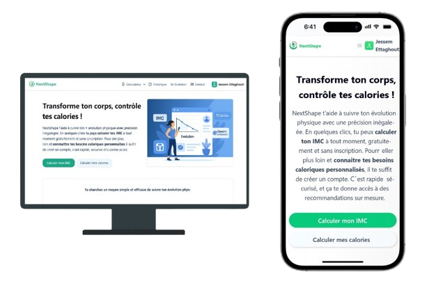

# NextShape


NextShape est une application web de suivi de forme physique, qui permet à un utilisateur de :

- Gérer son **compte utilisateur** (inscription avec vérification e-mail, connexion, modification, suppression, réinitialisation du mot de passe).
- Calculer son **IMC**, son **BMR**, son **TDEE** et ses **calories recommandées** en fonction de ses données personnelles.
- Visualiser l'évolution de ses données corporelles dans un **historique**.

## Fonctionnalités

- Authentification JWT via cookies HttpOnly
- Calcul de l'IMC
- Calcul du métabolisme de base (BMR), du TDEE et des calories recommandées
- Historique dynamique avec tableau et modale responsive
- Mise à jour et suppression des enregistrements
- Envoi de codes par email via SMTP (Brevo)
- Pipeline CI/CD avec test et déploiement Render (dev/prod)

## Outils :

L'application est réalisée avec :

- **Frontend** : Vue 3, TypeScript, PrimeVue, Pinia, Vite
- **Backend** : Django, Django REST Framework, JWT par cookie HttpOnly
- **Base de données** : PostgreSQL
- **CI/CD** : Docker, docker-compose, Render, GitHub Actions

<p align="center">

</p>

## Installation

### Prérequis

- Docker + Docker Compose + PostgreSQL
- Créer un fichier `.env` à la racine avec les variables suivantes :

```
# Environnement et secrets Django
ENV=local
DJANGO_SECRET_KEY=django-insecure-...
DJANGO_DEBUG=True
DJANGO_ALLOWED_HOSTS=127.0.0.1,localhost

# Secrets de la base de données
DATABASE_NAME=nextshape_db
DATABASE_USER=nextshape_user
DATABASE_PASSWORD=nextshape_pwd
DATABASE_HOST=db #(en lançant avec Docker et localhost si on veut lancer le serveur avec le terminal)
DATABASE_PORT=5432

# Secrets pour l'envoi de mails à partir du serveur Django
#(Exemple : utilisation de Brevo)
EMAIL_BACKEND=django.core.mail.backends.smtp.EmailBackend
EMAIL_HOST=smtp.brevo.com
EMAIL_PORT=587
EMAIL_HOST_USER=user@email.com
EMAIL_HOST_PASSWORD=motdepasse
DEFAULT_FROM_EMAIL=NextShape <dev@email.com>
EMAIL_USE_TLS=True

# URL vers l'API qu'utilisera le front pour envoyer les requêtes.
VITE_API_URL=http://localhost:8000/api/
```

- Lancer en local

```
docker-compose up --build
```

- Puis aller sur :

  - Interface web : http://localhost

  - API : http://localhost:8000/api/

### Base de données de test

Un utilisateur fictif avec des données déjà initialisées peut être un bon moyen de faire une démo très rapidement.
C'est pour cela que durant le ENTRYPOINT, on réalise un **seed** qui injecte ces données fictives :

- Utilisateur :
  - Email : jessem@mail.com
  - Mot de passe : 123 (Pas du tout sécurisé comme mot de passe)
- Les données de l'utilisateur (des calculs de besoins caloriques) trouvés à la page Historique.
